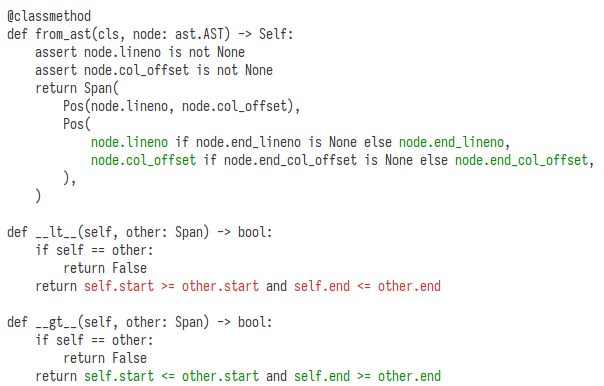

fine-coverage
=============

..

    TODO: add to PyPI?

    |PyPI Version| |PyPI Python Version|

A simple experiment to trace coverage at a granularity finer than lines,
using Python 3.11’s new debug ranges information (`PEP 657`_).

Table of Contents
-----------------

- Usage_
- Installation_
- License_

Usage
-----

After installation, use ``fine-coverage`` or ``python -m fine_coverage``.
It accepts the ``--cov`` CLI option telling it what Python module to track coverage for,
as well as a module name to run and its options:

.. code:: console

   fine-coverage --cov=mypackage pytest -v

In the above example, it will report which code in `mypackage` got executed
while running the equivalent of `python -m pytest -v`.

Below you see an excerpt from the output when run on its own code.
So far only tracks `and`, `or`, and `if else` expressions.

Installation
------------

.. code:: console

   rm -rf dist
   python -m build
   pip install dist/*.whl

License
-------

``fine-coverage`` is distributed under the terms of the GPL_ license.

.. |PyPI Version| image:: https://img.shields.io/pypi/v/fine-coverage.svg
   :target: https://pypi.org/project/fine-coverage
.. |PyPI Python Version| image:: https://img.shields.io/pypi/pyversions/fine-coverage.svg
   :target: https://pypi.org/project/fine-coverage
.. _PEP 657: https://peps.python.org/pep-0657/
.. _GPL: https://spdx.org/licenses/GPL.html
